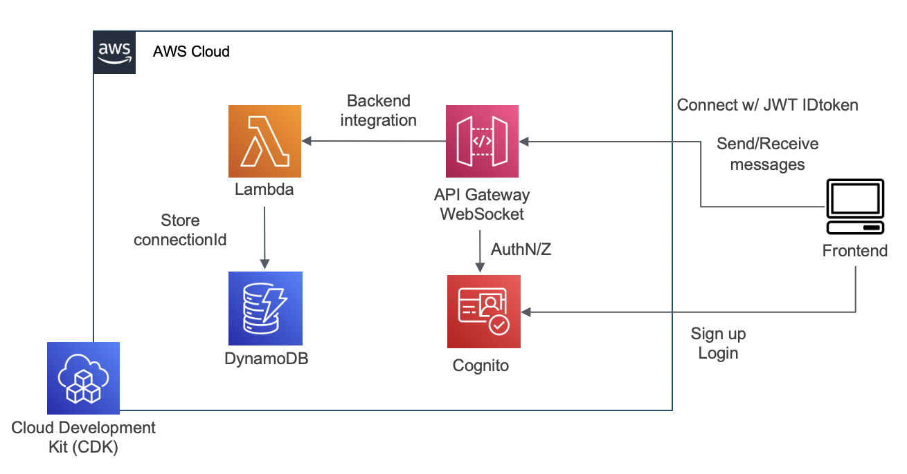

# WebSocket API Cognito Auth Sample
[](https://github.com/aws-samples/websocket-api-cognito-auth-sample/actions/workflows/build.yml)

## 概要
Amazon API Gateway WebSocket APIにCognito認証を組み込むサンプルです。

Lambda AuthorizerとAPI GatewayのためのLambda関数と、バックエンドデプロイのためのCDKコード、動作確認のためのフロントエンドの実装が含まれます。

## アーキテクチャ
本サンプルは、WebSocket APIでのCognito JWT認証を実現するための最小限のアーキテクチャを実装しています。

実装の詳細は、[実装の説明](#実装の説明)の節を参照してください。

本アーキテクチャを他のシステムと連携する際は、DynamoDBのテーブルに保存されたCognitoユーザーIDとWebSocket Connection IDのペアを利用することも可能です。



## デプロイ方法
**前提条件**: 下記が準備・インストールされていることを前提とします:
* IAM権限の設定
* `npm` のインストール


バックエンドは下記のコマンドによりデプロイしてください。  
CDKについての詳細は、[Getting started with the AWS CDK](https://docs.aws.amazon.com/cdk/latest/guide/getting_started.html)をご覧ください。

```sh
cd backend
npm ci
cd ../cdk
npm ci
npx cdk deploy --require-approval never
```

デプロイが完了すると、CLIに下記のメッセージが表示されます。

```sh
Outputs:
BackendStack.region = ap-northeast-1
BackendStack.userPoolId = ap-northeast-1_xxxxxxx
BackendStack.userPoolWebClientId = xxxxxxxxxxxxxxxxxxxxxxxxxx
BackendStack.webSocketEndpoint = wss://xxxxxxxxx.execute-api.ap-northeast-1.amazonaws.com/prod
```

この情報は次のフロントエンドのセットアップに利用することができます。

フロントエンドは`localhost:3000`で動作確認します。
下記のように `.env.sample` をリネームして**必要な項目を埋めてください**。
```sh
cd frontend
cp .env.sample .env.local
```

あとは必要なパッケージをインストールして、localhostでlistenさせます。
```sh
# frontend ディレクトリ内で実行
npm ci
npm run dev
```

ブラウザを開き、http://localhost:3000 にアクセスしてください。

## 実装の説明
### IaC
下記のAWSリソースを作成するCDKプロジェクトです:
* API Gateway WebSocket API
* Lambda関数 2つ
    * WebSocket APIのインテグレーション
    * Lambda Authorizer
* Cognito ユーザープール・クライアント
* DynamoDB テーブル
    * Cognito userIdとWebSocket接続IDの対応を保存するテーブル

コードは `cdk` ディレクトリ以下に存在します。  

### バックエンド
バックエンドは2つのLambda関数で構成されます。
1. `authorizer`
2. `websocket`

`authorizer` はTypeScriptで実装された、[WebSocket API用のLambda authorizer](https://docs.aws.amazon.com/apigateway/latest/developerguide/apigateway-websocket-api-lambda-auth.html)です。  
この関数は次の処理を実行します:
1. `idToken` クエリストリングからJWTを取得し、デコード
2. Cognitoサーバーから、JWT署名の公開鍵を取得
3. JWTの`kid`からJWT署名を検証
4. その他のClaimを、Lambdaの環境変数で注入された値と比較して検証

実装の詳細は、[Verifying a JSON Web Token
](https://docs.aws.amazon.com/cognito/latest/developerguide/amazon-cognito-user-pools-using-tokens-verifying-a-jwt.html)も参照してください。

`websocket` はTypeScriptで実装された、WebSocket APIのインテグレーションです。  
この関数はWebSocketのルートに応じて、次の処理を実行します:
1. `$connect` ルート
    * CognitoのUserIdとWebSocketの接続IDのペアをDynamoDBに保存します
2. `$disconnect` ルート
    * 接続IDをDynamoDBから削除します
3. `$default` ルート
    * 送られた内容をそのままエコーバックします

DynamoDBに保存された情報を利用して、他のサーバーから特定のCognitoユーザーにWebSocketメッセージを送信する、といった用途に応用可能です。  
[Use @connections commands in your backend service
](https://docs.aws.amazon.com/apigateway/latest/developerguide/apigateway-how-to-call-websocket-api-connections.html)もご参照ください。

### フロントエンド
フロントエンドは、ReactのSPAで構成されています。
主要なコンポーネントは [`src/components/echo.tsx`](frontend/src/components/echo.tsx) に実装されています。

認証のために、Cognito UserPoolのIDトークンをクエリストリングに付与しています。WebSocket APIの認証方法にはいくつか考えられますが、それぞれトレードオフがあります。詳細は[こちらのIssue](https://github.com/aws-samples/websocket-api-cognito-auth-sample/issues/15#issuecomment-1173401338)もご覧ください。

## Clean up
検証が完了した後は、下記のコマンドで作成されたAWSリソースを削除することができます。

```sh
cd cdk
npx cdk destroy --force
```

## Security

See [CONTRIBUTING](CONTRIBUTING.md#security-issue-notifications) for more information.

## License

This library is licensed under the MIT-0 License. See the LICENSE file.
